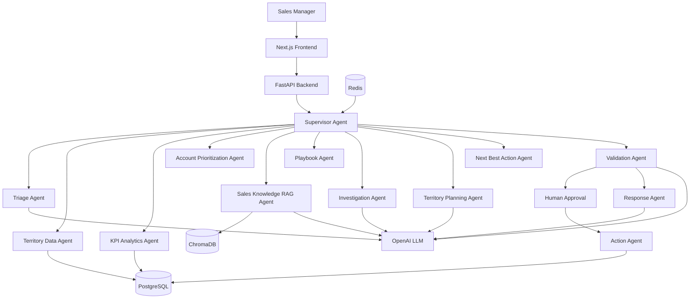
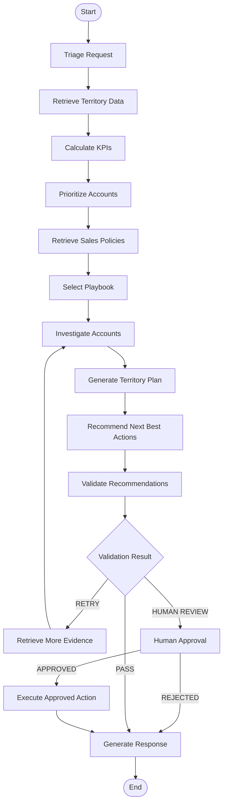

# Agentic Sales Territory Planning Assistant

## Overview
This project implements a production-style multi-agent sales territory planning assistant for retail sales organizations. It combines LangGraph orchestration, structured data retrieval, deterministic KPI logic, ChromaDB-backed RAG, human approval, and auditable outputs to generate evidence-based territory plans.

## Business Problem
Sales teams manage many accounts across territories. Manual work usually leads to inconsistent prioritization, missing risk signals, and weak evidence behind recommendations. This system automates the investigation and planning workflow while maintaining guardrails and human approval for consequential actions.

## Business Workflow
1. Receive a user request about a territory or account.
2. Triage the request and determine intent.
3. Retrieve territory and account records from data tools.
4. Calculate deterministic KPIs.
5. Rank accounts by value, growth, and risk.
6. Retrieve relevant sales policies and playbooks through RAG.
7. Select the correct playbook.
8. Investigate evidence and identify expansion or risk opportunities.
9. Generate a territory plan and next-best actions.
10. Validate recommendations against policy and confidence requirements.
11. Pause for manager approval when consequential actions are involved.
12. Produce a grounded final response with citations and audit info.

## Features
- Multi-agent orchestration with specialized roles
- LangGraph-based workflow with bounded retry logic
- Tool calling for sales data and action execution
- Deterministic KPI calculations independent from LLM arithmetic
- ChromaDB-backed retrieval for playbooks and policies
- Human approval gate for consequential actions
- Explainable outputs with evidence and policy citations
- Audit logging and traceability
- FastAPI backend and Next.js frontend
- Docker-ready local deployment

## Architecture



## Agent Responsibilities
- Supervisor: routes work and keeps state consistent.
- Triage: extracts intent, territory, account, and priority signals.
- Territory Data: pulls structured CRM-like data.
- KPI Agent: computes deterministic sales metrics.
- Prioritization: ranks accounts using a scoring service.
- Knowledge/RAG: retrieves policy and playbook evidence.
- Playbook Agent: selects recommended playbook templates.
- Investigation: synthesizes evidence and risk summary.
- Territory Planning: creates a plan for a region.
- Next Best Action: recommends practical sales steps.
- Validation: checks evidence, compliance, and approval conditions.
- Response Agent: outputs grounded final results.

## Technology Stack
- Frontend: Next.js, React, TypeScript, Tailwind CSS
- Backend: Python, FastAPI, Pydantic
- Agent orchestration: LangChain, LangGraph
- LLM: OpenAI API with configurable model variables
- Vector search: ChromaDB
- Database: PostgreSQL and SQLite fallback
- Cache/session: Redis
- Data access: SQLAlchemy models and tool wrappers

## RAG Architecture

```mermaid
flowchart LR
DOC[Sales Documents]
LOAD[Document Loader]
CLEAN[Cleaning]
CHUNK[Chunking]
META[Metadata Extraction]
EMBED[Embeddings]
CHROMA[(ChromaDB)]
RET[Retriever]
FILTER[Metadata Filter]
RERANK[Reranker]
CTX[Context Builder]
LLM[OpenAI LLM]
CITE[Citation Generator]

DOC --> LOAD
LOAD --> CLEAN
CLEAN --> CHUNK
CHUNK --> META
META --> EMBED
EMBED --> CHROMA
CHROMA --> RET
RET --> FILTER
FILTER --> RERANK
RERANK --> CTX
CTX --> LLM
LLM --> CITE
```



## LangGraph Workflow



## Territory Prioritization Logic
The prioritization service uses deterministic scoring based on:
- revenue growth
- opportunity value
- product adoption
- customer engagement
- risk and service issues
- health score

Example formula:

Priority Score = 0.30 * Growth + 0.25 * Opportunity + 0.20 * Adoption + 0.15 * Engagement + 0.10 * Health - Risk Penalty

This logic is implemented in the scoring service and not left to the LLM.

## Database Design
The system includes SQLAlchemy models for:
- users
- territories
- accounts
- products
- opportunities
- sales_activities
- service_issues
- sessions
- messages
- workflows
- agent_runs
- tool_calls
- documents
- document_chunks
- playbooks
- approvals
- audit_logs
- evaluations

## Tool Architecture
Data tools handle account, territory, opportunity, and service facts. Action tools produce auditable outcomes such as follow-ups, escalations, and task creation. Only actual tool responses can confirm success.

## Human Approval Workflow
Any consequential action must pass validation and then be routed to a manager for approval. This includes strategic changes, discounts, CRM modifications, and high-value task creation. The workflow pauses until approval is granted or rejected.

## Security
- environment variables used for configuration
- secrets never exposed to the frontend
- input validation via Pydantic
- CORS configured for local API integration
- prompt injection defense by clearly separating system instructions from retrieved content
- account and territory ownership checks are treated as enforcement boundaries

## Observability
This project tracks workflow state, agent execution, tool calls, and human review state. The implementation is structured to support OpenTelemetry or LangSmith integration later.

## Evaluation
The repository includes a sample evaluation structure with dataset, evaluator, metrics, and report scaffolding. This is intended for ranking quality, policy compliance, citation correctness, and action safety evaluation.

## Project Structure
```text
agentic-sales-territory-planning-assistant/
├── backend/
│   └── app/
│       ├── agents/
│       ├── config/
│       ├── data/
│       ├── database/
│       ├── graph/
│       ├── models/
│       ├── prompts/
│       ├── rag/
│       ├── services/
│       ├── tools/
│       ├── main.py
│       └── __init__.py
├── frontend/
│   ├── app/
│   ├── package.json
│   └── ...
├── data/
├── scripts/
├── evaluation/
├── tests/
├── .env.example
├── .gitignore
├── Dockerfile
├── docker-compose.yml
├── requirements.txt
├── package.json
├── README.md
└── ...
```

## Installation
```bash
python -m venv .venv
source .venv/bin/activate
pip install -r requirements.txt
```

## Environment Variables
Create a .env file from .env.example and then fill in the values you need. Keep secrets private and do not expose them to the browser.

## Running Locally
Backend:
```bash
uvicorn backend.app.main:app --reload --host 0.0.0.0 --port 8000
```
Frontend:
```bash
cd frontend
npm install
npm run dev -- --hostname 0.0.0.0 --port 3000
```
Docker:
```bash
docker compose up --build
```

## API Documentation
The FastAPI application exposes endpoints for health, chat, workflow execution, territory analysis, account analysis, review, and document ingestion.

## Sample Requests
```bash
curl -X POST http://localhost:8000/api/chat \
  -H "Content-Type: application/json" \
  -d '{"user_query":"Analyze territory T001 and identify the top accounts","session_id":"demo-session"}'
```

## Testing
```bash
pytest -q
```

## Deployment
This app is prepared for local execution and is structured to be deployable to Docker-based environments and cloud hosting. The frontend is Vercel-ready and the backend is containerized for deployment to AWS, Azure, Render, or Railway.

## Limitations
- Current knowledge data is synthetic and deterministic for local demos.
- Vector retrieval is implemented using a lightweight local deterministic mock and can be swapped for production Chroma config later.
- The app does not yet include production auth or enterprise-grade multi-tenant RBAC.

## Future Enhancements
- real PostgreSQL and Redis integration
- production-grade RBAC and session management
- full LangSmith/OpenTelemetry tracing
- richer evaluation and ranking metrics
- real ChromaDB deployment and metadata filters
- manager approval UI and persistence
- cloud deployment pipeline

---
This repository is a functioning starter implementation of the architecture described in the specification, with a live multi-agent workflow, local API, sales data mock system, RAG retrieval layer, and frontend dashboard.
